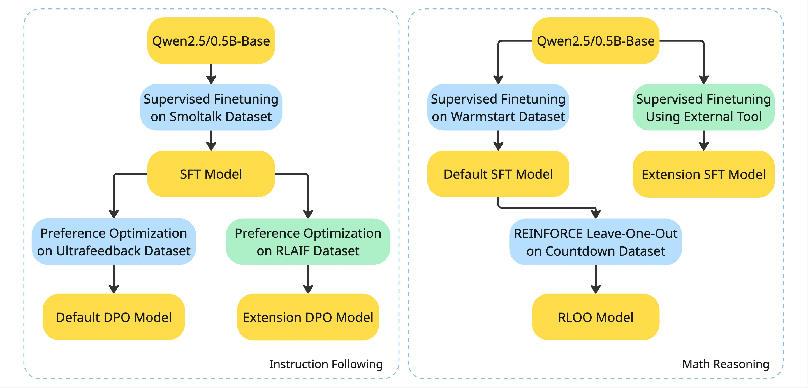
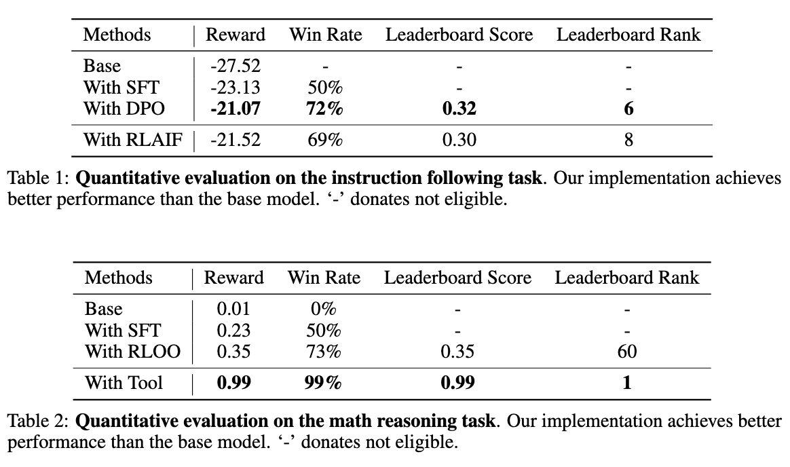

## Fine-Tuning Large Language Models with Reinforcement Learning
Author: Feiyang Zhu, Shutong Zhang, Siyuan Wu

### Abstract
Large language models (LLMs) have demonstrated strong performance across a range of tasks, including text generation, image classification, and reasoning. To better align these base models with specific user needs, fine-tuning plays a crucial role. In this project, we aim to improve a large language model’s instruction following and math reasoning abilities through fine-tuning. Specifically, we work on Qwen-2.5-0.5B model, apply Supervised Fine-Tuning (SFT) and incorporate reinforcement learning techniques, including Direct Preference Optimization (DPO) and REINFORCE Leave-One-Out (RLOO). For the instruction following task, we use the SmolTalk dataset and the UltraFeedback dataset for SFT and DPO, respectively. We also incorporate Reinforcement Learning from AI Feedback (RLAIF) for preference scoring. For the math reasoning task, we use the WarmStart dataset and the Countdown dataset for SFT and RLOO, respectively. To further boost the accuracy, we use a calculator tool during both training and inference time.

### Methods

<b>Overview of our training pipeline for instruction following and math reasoning tasks.</b> For instruction following (left), we apply supervised fine-tuning on the SmolTalk dataset, followed by preference optimization using either human feedback (UltraFeedback) or AI-generated feedback (RLAIF), resulting in default and extension DPO models. For math reasoning (right), we fine-tune on the WarmStart dataset and further optimize using REINFORCE Leave-One-Out (RLOO) on the Countdown dataset, while the extension incorporates supervised fine-tuning with an external calculator tool.

### Results

Experiments show that our proposed methods consistently improve model performance on both instruction following and math reasoning tasks. Compared to the base models, all advanced approaches, including SFT, DPO, RLAIF, RLOO, and our extension, achieve higher reward scores, win rates, and leaderboard rankings. Notably, the external tool extension achieves the best performance across all evaluation metrics and the top of the leaderboard.

### Instllation
Install and activate the conda environment using the following command:

```
conda env create -f environment.yml
conda activate cs224r
```

### Data Generation
Generate dataset for SFT and DPO using the following command:
```
python preprocess_sft_datasets.py
python preprocess_ultrafeedback.py
```
Generated datasets will be stored in `./processed_dataset` folder.

### Supervised Finetuning
To finetune the model on the smoltalk dataset, run:
```
python train_sft.py --config config/sft_smol.yaml # You may need to manually modify path the config file
```
To finetune the model on the warmstart dataset, run:
```
python train_sft.py --config config/sft_warm.yaml # You may need to manually modify path the config file
```
Trained models will be saved in `./SFT/models` folder.

### Direct Preference Optimization
To run DPO on the ultrafeedback dataset, run:
```
python train_dpo.py # You may need to manually modify path in DPO/config/dpo.yaml
```
Trained models will be saved in `./DPO/ckpts` folder.

### REINFORCE Leave One-Out
To run RLOO on the countdown dataset, run:
```
python train_rloo.py # You may need to manually modify path in rloo/config/rloo.yaml
```
Trained models will be saved in `./RLOO/models` folder.

### Evaluation
To evaluate the trianed model on the ultrafeedback dataset, run:
```
python eval_leaderboard_instruction.py --model_path $model_path --dataset_path $dataset_path
```
To evaluate the trianed model on the countdown dataset, run:
```
python eval_leaderboard_countdown.py --model_path $model_path --dataset_path $dataset_path
```

### Extention
- External Tool: check `./data/generate_countdown_gt.py` to generate SFT data with external tool. Run `eval/eval_leaderboard_countdown_ext.py` for inference.
- RLAIF: check `RLAIF/generate.py` to generate AI preference dataset.
